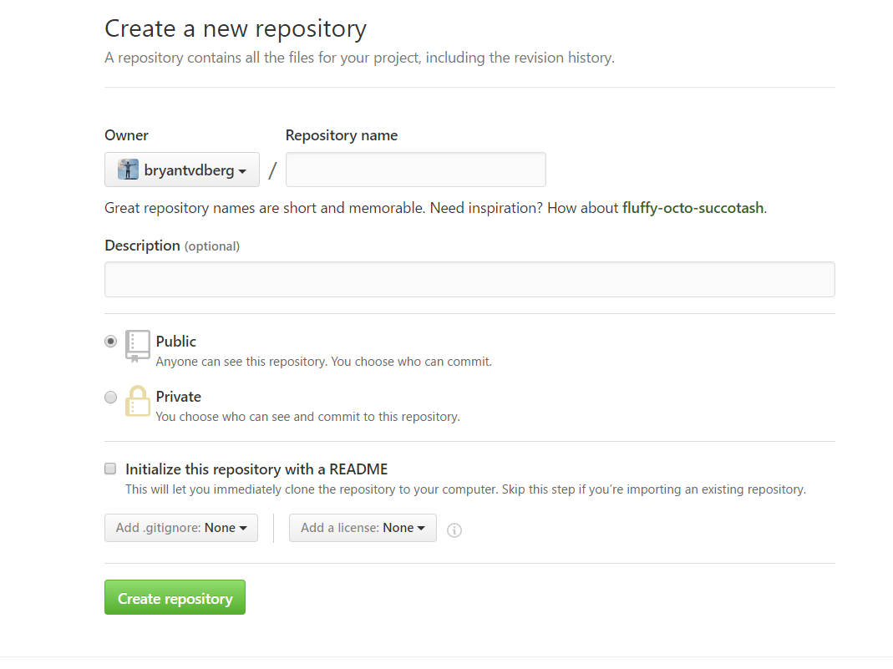

# Tutorial-Github
Made by: Bryant van den Berg, Rune Daanen

## Step 1. Create a Repository
A repository is usually used to organize a single project. Repositories can contain folders and files, images, videos, spreadsheets, and data sets – anything your project needs. We recommend including a README, or a file with information about your project. GitHub makes it easy to add one at the same time you create your new repository. It also offers other common options such as a license file.

Your hello-world repository can be a place where you store ideas, resources, or even share and discuss things with others.

## To create a new repository

1. In the upper right corner, next to your avatar or identicon, click  and then select New repository.
2. Name your repository hello-world.
3. Write a short description.
4. Select Initialize this repository with a README.

## Step 2. Create a Branch
Branching is the way to work on different versions of a repository at one time.
By default your repository has one branch named master which is considered to be the definitive branch. We use branches to experiment and make edits before committing them to master.
When you create a branch off the 'master' branch, you’re making a copy, or snapshot, of master as it was at that point in time. If someone else made changes to the master branch while you were working on your branch, you could pull in those updates.
This diagram shows:
The master branch
A new branch called feature (because we’re doing ‘feature work’ on this branch)
The journey that feature takes before it’s merged into master 

## Have you ever saved different versions of a file? Something like:
story.txt
story-joe-edit.txt
story-joe-edit-reviewed.txt
Branches accomplish similar goals in GitHub repositories.
Here at GitHub, our developers, writers, and designers use branches for keeping bug fixes and feature work separate from our master (production) branch. When a change is ready, they merge their branch into master.
